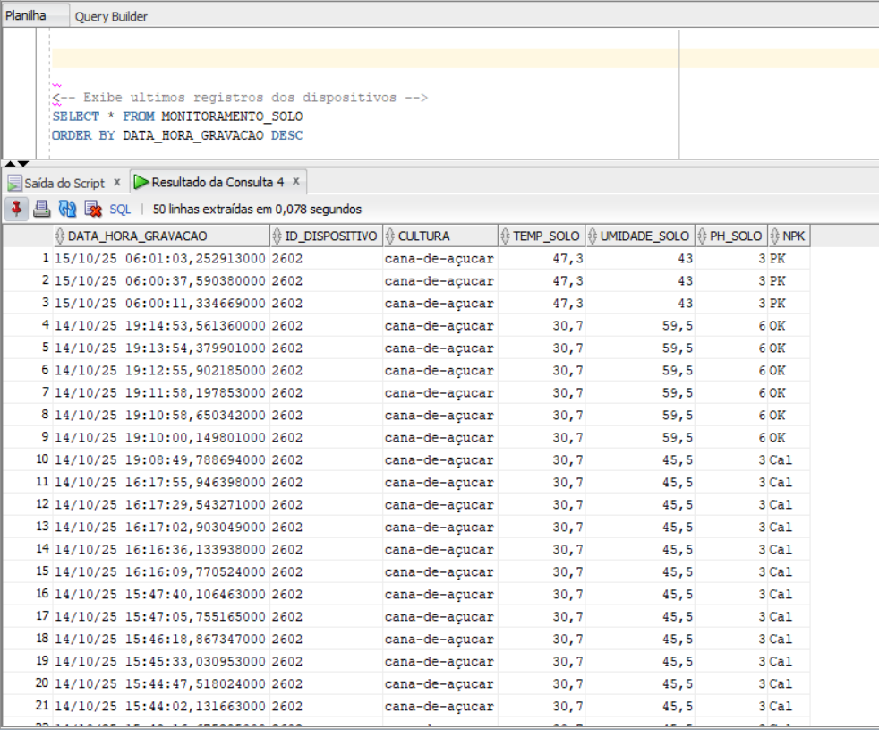
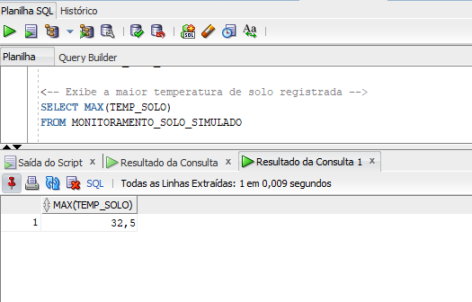
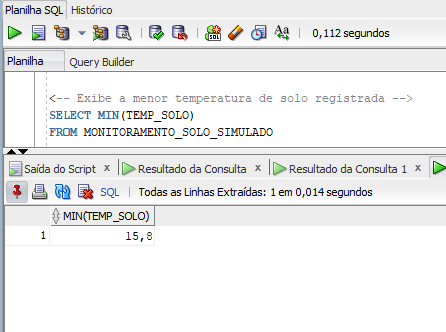
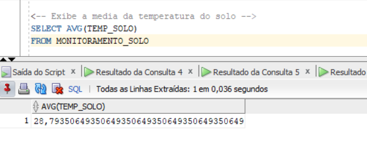
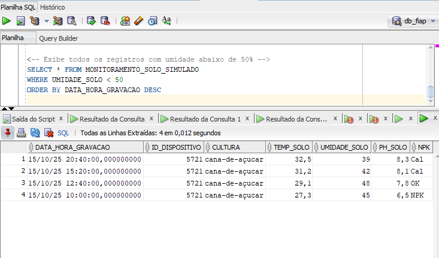

# FIAP - Faculdade de Informática e Administração Paulista

 

# FarmTech Solution - IoT Device

## Nome do grupo: Leno's

##  Integrantes: 
- <a href="https://www.linkedin.com/in/leon-gonzalez-8701b9199/">Pablo Leon Dimauro Gonzalez</a>

##  Professores:
### Tutor(a) 
- Ana Cristina Santos</a>
### Coordenador(a)
- <a href="https://www.linkedin.com/in/andregodoichiovato/">André Godoi</a>

## Descrição

Nesta fase do projeto, realizamos consultas no banco de dados Oracle. Como na fase anterior eu ja havia utilizado o banco de dados para outra atividade, já possuo os dados gravados, conforme mostra imagem abaixo:

Abaixo segue prints de consultas realizadas nos dados gravados.

O primeiro print exibe a maior temperatura do solo registrada:

O segundo, mostra a menor temperatura do solo:

A seguir, temos a media das temperaturas do solo de todos os dados gravados:

E por fim, uma consulta para exibir os registros onde a umidade do solo é menor que 50%, que no caso da lavoura escolhida (cana-de-açúcar) seria um cenário de escassez hídrica.

Todos os resultados foram organizados para exibir o ultimo dado gravado.

Um video do funcionamento desta etapa pode ser encontrado em: 

## Estrutura de pastas

Dentre os arquivos e pastas presentes na raiz do projeto, definem-se:

- <b>assets</b>: aqui estão os arquivos de imagem para a elaboração deste arquivo.

- <b>scripts</b>: Codigo em Python, realiza operações no banco de dados, comunicação MQTT, consultas a API e geração de alertas com base nos dados recebidos

- <b>src</b>: Código criado para funcionamento do ESP32.
  
- <b>README.md</b>: Este mesmo arquivo, onde é descrito todo o projeto.

## 🗃 Histórico de lançamentos

* 0.1.0 - 14/10/25

## 📋 Licença

<a property="dct:title" rel="cc:attributionURL" href="https://github.com/agodoi/template">MODELO GIT FIAP</a> por <a rel="cc:attributionURL dct:creator" property="cc:attributionName" href="https://fiap.com.br">Fiap</a> está licenciado sobre <a href="http://creativecommons.org/licenses/by/4.0/?ref=chooser-v1" target="_blank" rel="license noopener noreferrer" style="display:inline-block;">Attribution 4.0 International</a>.

