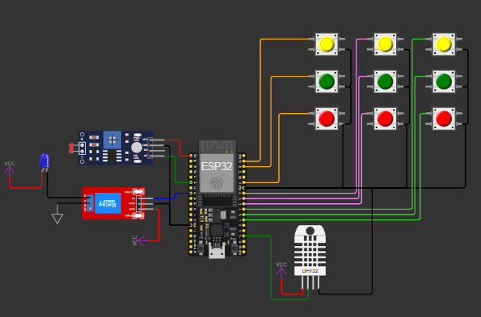

# FIAP - Faculdade de Informática e Administração Paulista

 

# FarmTech Solution - IoT Device

## Nome do grupo: Leno's

## 👨‍🎓 Integrantes: 
- <a href="https://www.linkedin.com/in/leon-gonzalez-8701b9199/">Pablo Leon Dimauro Gonzalez</a>

## 👩‍🏫 Professores:
### Tutor(a) 
<a href="https://www.linkedin.com/in/andregodoichiovato/">André Godoi</a>
### Coordenador(a)
- <a href="https://www.linkedin.com/in/andregodoichiovato/">André Godoi</a>

## 📜 Descrição

Este projeto implementa um sistema de **irrigação automatizada com ESP32**, que decide o tipo de irrigação (água, NPK ou calagem) de acordo com as condições do solo e do ambiente.  

O projeto tambem conta com a previsão climática dos próximos 7 dias e envia essas informações para o dispositivo em campo via MQTT, com o broker Flespi.

Exemplo dos dados transmitidos:

time; temperature_2m_min; temperature_2m_max; precipitation_probability_max;

O circuito foi montado conforme imagem abaixo:

Para que o projeto fosse realizado com o simulador Wokwi, foi necessário fazer algumas adaptações, são elas:

* 3 botões para indicar nivel baixo, medio ou alto, para os 3 macronutrientes NPK.
* pH do solo foi obtido com o sensor LDR e uma conversao dos valores maximos e minimos do sensor para 0 a 14, conforme escala pH.
* Para temperatura e umidade do solo, foi utilizado o sensor DHT22.

Um video do funcionamento pode ser encontrado em: https://youtu.be/r24oL8WKGLs

## 📁 Estrutura de pastas

Dentre os arquivos e pastas presentes na raiz do projeto, definem-se:

- <b>assets</b>: aqui estão os arquivos relacionados a elementos não-estruturados deste repositório, como imagens.

- <b>scripts</b>: script para consulta de API, conexao e envio de dados via MQTT.

- <b>src</b>: Código criado para funcionamento do ESP32.
  
- <b>README.md</b>: Este mesmo arquivo, onde é descrito todo o projeto.

## 🔧 Como executar o código

Para executar o projeto, é necessário ter algumas extensões instaladas, como:

  * Platform.io
  * Wokwi Simulator

As bibliotecas utilizadas, PubSubClient e DHTesp, serão instaladas automaticamente pelo platform.io

Tendo as extensões instaladas, basta clonar o repositorio, abrir o arquivo platform.ini e aguardar o platform.io iniciar o projeto e baixar bibliotecas.

Após isso, abra o diagram.json e inicie a simulação.

Para a consulta a API, abra o cmd na pasta e inicie o script api.py e pronto. Todos os dias as 06:30 serão enviados ao ESP32 dados da previsão climatica.

## 🗃 Histórico de lançamentos

* 0.1.0 - 14/10/25

## 📋 Licença

<a property="dct:title" rel="cc:attributionURL" href="https://github.com/agodoi/template">MODELO GIT FIAP</a> por <a rel="cc:attributionURL dct:creator" property="cc:attributionName" href="https://fiap.com.br">Fiap</a> está licenciado sobre <a href="http://creativecommons.org/licenses/by/4.0/?ref=chooser-v1" target="_blank" rel="license noopener noreferrer" style="display:inline-block;">Attribution 4.0 International</a>.

